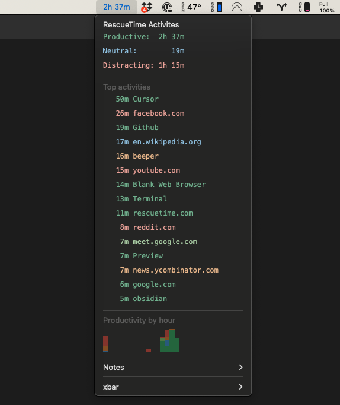

# RescueTime Activities - An xbar Plugin

Monitor your RescueTime activities and distractions directly from the macOS menu bar with this xbar plugin.

Requirements:

- macOS 10.15 (Catalina) or later; tested on 14.5 (Sonoma)
- [xbar](https://github.com/matryer/xbar) (the BitBar reboot), install manually or via [Homebrew](https://brew.sh/), `brew install --cask xbar`
- A [RescueTime](https://www.rescuetime.com/) account
- A [RescueTime API key](https://www.rescuetime.com/anapi/manage), which you need to set in the plugin settings.

This plugin is inspired by the [RescueTime plugin](https://xbarapp.com/docs/plugins/Dev/rescuetime.1h.py.html) by [Paul Traylor](https://github.com/kfdm).
I rewrote it to display a detailed list of activities, rather than just a summary of productive and distractive time.

## How it looks

## Further Reading

Check out my earlier blog post: [ADHD Tech Stack: Auto Time Tracking](https://p.migdal.pl/blog/2020/05/adhd-tech-stack-auto-time-tracking).

## TODO

- Add a weekly productivity chart
